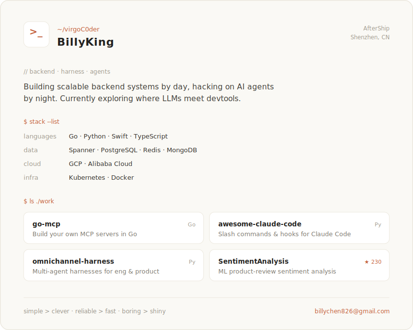

<!--
  Profile card is rendered as an SVG so the full styling survives on GitHub.
  Edit assets/profile-light.svg / profile-dark.svg to change content.
-->

<picture>
  <source media="(prefers-color-scheme: dark)" srcset="assets/profile-dark.svg">
  
</picture>

  

