<div align="center">

<!-- Clean Anthropic-style header — warm, minimal -->

### `virgoC0der`

```
 ╭──────────────────────────────────────────────────────╮
 │                                                      │
 │   Hi, I'm virgoC0der.                                │
 │   Backend Engineer · Harness Developer · Agent Hacker│
 │                                                      │
 │   Building scalable backend systems by day,          │
 │   hacking on AI agents by night.                     │
 │                                                      │
 │   Currently exploring where LLMs meet devtools.      │
 │                                                      │
 ╰──────────────────────────────────────────────────────╯
```


</div>

<br/>

<!-- Claude Thinking Animation -->
##  &nbsp;Thinking...

<div align="center">



<br/><br/>

> *"The best code is written by understanding the problem deeply enough that the solution becomes obvious."*

</div>

<br/>

<div align="center">
  
</div>

<br/>

##  &nbsp;About

```go
package main

type Engineer struct {
    Focus    []string
    Stack    []string
    Mindset  string
}

me := Engineer{
    Focus:   []string{"distributed systems", "cloud architecture", "AI agents"},
    Stack:   []string{"Go", "Python", "GCP", "K8s", "Spanner", "Redis"},
    Mindset: "simple > clever · reliable > fast · boring > shiny",
}
```

<br/>

<div align="center">
  
</div>

<br/>

##  &nbsp;Stack

<div align="center">

<table>
<tr>
<td align="center" width="150">

**Languages**

</td>
<td align="center" width="150">

**Data**

</td>
<td align="center" width="150">

**Cloud**

</td>
<td align="center" width="150">

**Infra**

</td>
</tr>
<tr>
<td align="center">


</td>
<td align="center">


</td>
<td align="center">


</td>
<td align="center">


</td>
</tr>
</table>

</div>

<br/>

<div align="center">
  
</div>

<br/>

##  &nbsp;Stats

<div align="center">



<br/><br/>

<details>
<summary><code>$ cat ./raw-metrics.log</code></summary>
<br/>


</details>

</div>

<br/>

<div align="center">
  
</div>

<br/>

<div align="center">


<br/><br/>

```
 Think deeply. Build carefully. Ship quietly.
```

<br/>

<a href="https://virgoc0der.github.io">
  
</a>
&nbsp;&nbsp;
<a href="mailto:billychen826@gmail.com">
  
</a>

<br/><br/>

</div>
